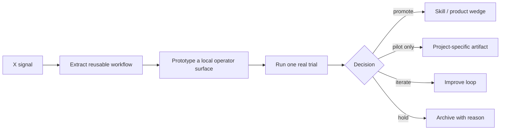

# Multimodal Agent Steering Surface Workflow Map

Source: [[../../Ideas/Multimodal Agent Interfaces Beyond Chat.md|Multimodal Agent Interfaces Beyond Chat]]

## Why it matters
Chat-only agent products miss the way humans actually steer collaborators: pointing, circling, talking, interrupting, and reviewing shared context. This package turns that signal into a concrete UI pattern Vinay can reuse for ResumeSetGo-style reviews and agent workbenches.

## Operator rule
Prepared artifacts are not validation. Only filled trial evidence can justify promotion.
